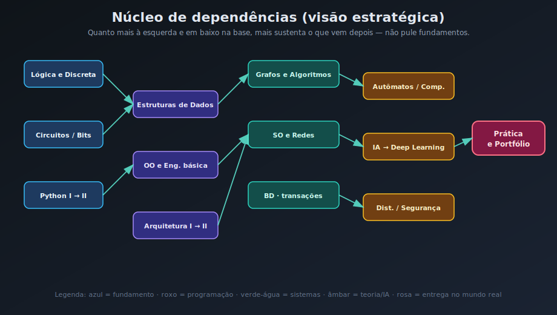
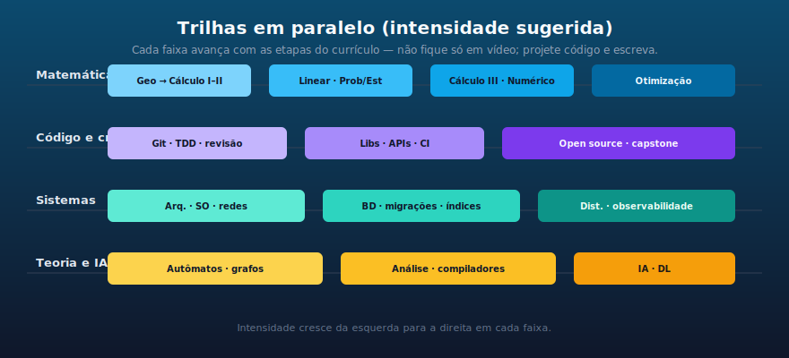
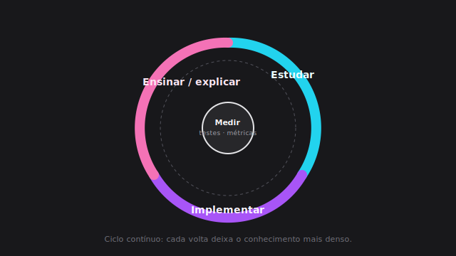
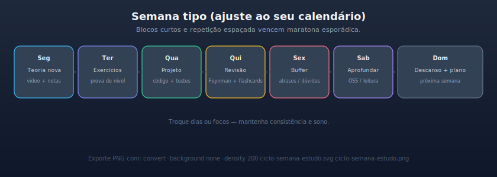
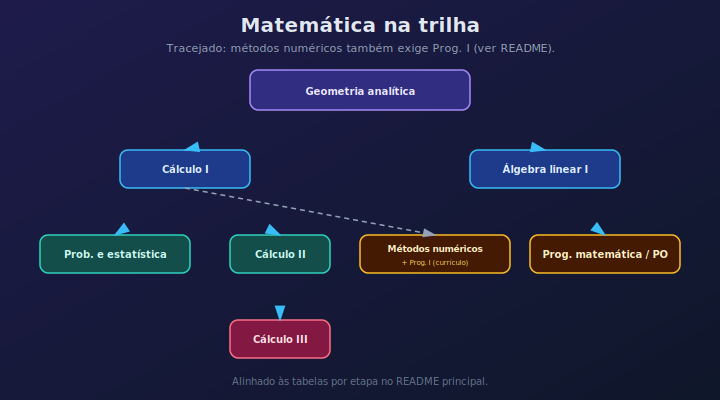
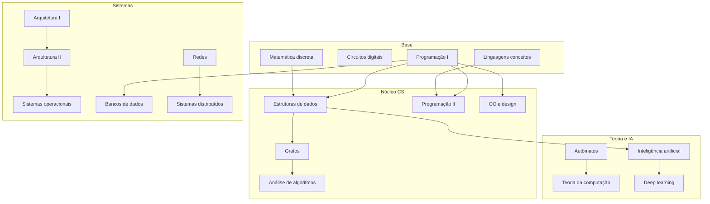

# Curso de Ciência da Computação — trilha potente (autodidata)

<!-- Badge: se o repositório no GitHub tiver outro `usuario/repo`, ajuste as duas URLs abaixo. -->

Este repositório é um **currículo enxuto, exigente e atualizado**, pensado para quem quer ir **além de listas de playlists**: combina fundamentos de graduação, **craft de engenharia** (testes, revisão, CI, segurança mental), **projetos públicos** e **teoria que paga dividendos** (complexidade, concorrência, sistemas distribuídos).

Inspirado na abertura e na comunidade da [Universidade Livre / ciencia-da-computacao](https://github.com/Universidade-Livre/ciencia-da-computacao), aqui a proposta é **mais densa**: menos “só assistir”, mais **implementar, provar e documentar**.

**English overview:** [README.en.md](README.en.md) (o currículo completo continua em português neste ficheiro).

**Plano estilo graduação (4 anos, 8 semestres):** [docs/graduacao-4-anos.md](docs/graduacao-4-anos.md) — do básico ao especialista, alinhado ao grafo e às provas de nível.

## Navegação

| Área | Onde |
|------|------|
| Acompanhar progresso | [checklist.md](checklist.md) |
| Bibliografia e engenharia | [extras/bibliography/](extras/bibliography/) · [Módulos elevados](extras/modulos-elevados.md) |
| Ferramentas (lista maior) | [extras/ferramentas.md](extras/ferramentas.md) |
| Playlists + links UBL | [extras/cursos-referencia-ubl.md](extras/cursos-referencia-ubl.md) |
| Trilhas pós-núcleo | [specializations/](specializations/) |
| Contribuir | [CONTRIBUTING.md](CONTRIBUTING.md) · [CODEOWNERS](.github/CODEOWNERS) · [MAINTAINERS.md](MAINTAINERS.md) |
| Conduta | [CODE_OF_CONDUCT.md](CODE_OF_CONDUCT.md) |
| Segurança | [SECURITY.md](SECURITY.md) |
| Onde pedir ajuda | [SUPPORT.md](SUPPORT.md) |
| Template repo de estudos | [templates/repositorio-de-estudos/](templates/repositorio-de-estudos/) |
| Dúvidas comuns | [FAQ.md](FAQ.md) |
| Roadmap (ideias) | [docs/roadmap.md](docs/roadmap.md) |
| Plano intensivo (90 dias) | [docs/plano-intensivo-90-dias.md](docs/plano-intensivo-90-dias.md) |
| **Graduação 4 anos (8 semestres)** | [docs/graduacao-4-anos.md](docs/graduacao-4-anos.md) |
| Rubrica capstone | [docs/rubrica-capstone.md](docs/rubrica-capstone.md) |
| Grafo do currículo (JSON) | [data/curriculum.json](data/curriculum.json) · [tools/README.md](tools/README.md) · [requirements-dev.txt](requirements-dev.txt) · `tools/verify_repo.sh` |
| Progresso vs bloqueios | [data/progress.json](data/progress.json) · `python3 tools/curriculum_progress.py` · [docs/curriculum-progresso.md](docs/curriculum-progresso.md) |
| Glossário PT / EN | [docs/glossario.md](docs/glossario.md) |
| Exercícios por disciplina (banco ampliado) | [docs/exercicios-por-disciplina.md](docs/exercicios-por-disciplina.md) |
| English overview | [README.en.md](README.en.md) |
| CI — verificação de links | [`.github/workflows/links.yml`](.github/workflows/links.yml) · [`.lycheeignore`](.lycheeignore) |

### Publicar um fork

Se o remoto não for `luduranoficiall/ciencia-da-computacao`, atualize o **badge** logo acima (substitua usuário e nome do repositório nas duas URLs). O workflow continua válido; o cron e `pull_request` usam o repositório onde o Actions estiver habilitado.

---

## Por que este material é “mais potente”

| Dimensão | Foco aqui |
|----------|-----------|
| **Metodologia** | Ciclo fixo: estudar → codificar → explicar (Feynman) → medir (testes, benchmarks, checklist). |
| **Engenharia** | Git fluente, TDD quando fizer sentido, revisão de código, CI mínimo, threat modeling básico — **não opcionais** para quem quer nível sênior. |
| **Matemática** | Mesma espinha dorsal (discreta, cálculo, linear, probabilidade), com **âncoras de aplicação** (ML, otimização, métodos numéricos). |
| **Sistemas** | Concorrência e I/O explicados com o mesmo rigor que algoritmos em memória. |
| **Teoria** | Autômatos, complexidade e compiladores como **ferramentas de pensamento**, não só prova. |
| **Carreira** | Portfólio com critérios de aceite; contribuição open source como disciplina, não como frase de efeito. |

---

## Imagens do currículo (diagramas próprios)

**Mapa estratégico de dependências** — use antes de fuçar ordem das matérias:

**Trilhas em paralelo** — matemática, código, sistemas e teoria/IA avançando juntos:

**Ciclo de aprendizado** — o hábito que multiplica retenção:

**Semana tipo** — exemplo de distribuição de focos (ajuste ao seu ritmo):

**Matemática** — pré-requisitos entre disciplinas da grade (linha tracejada: Métodos numéricos também exige Programação I):

> **Fonte canónica do grafo** (pré-requisitos exatos para scripts): [`data/curriculum.json`](data/curriculum.json). Os SVG abaixo são **visão estratégica** — rótulos podem agrupar temas; em caso de dúvida, prevalece o JSON e o validador.

> No GitHub, os SVG renderizam inline. Para **slides ou PDF**, pode gerar PNG @ 200 DPI localmente (não versionados por defeito — evita duplicar binários no Git). Exemplo com ImageMagick: `convert -background none -density 200 assets/grafo-pre-requisitos.svg grafo-pre-requisitos.png` (repita para cada `.svg` em `assets/`).

---

## Diagrama Mermaid (dependências resumidas)

---

## Pré-voo obrigatório (semanas 1–4)

| Tópico | Recurso (exemplos) | Meta |
|--------|-------------------|------|
| Aprender a aprender | [Aprendendo a aprender](https://pt.coursera.org/learn/aprender) (Coursera) | Rotina fixa + repetição espaçada |
| Organização | Zettelkasten ou equivalente; calendário realista | Notas ligadas por conceitos, não por aula |
| Git profissional | [Pro Git](https://git-scm.com/book/pt-br/v2) (livro gratuito) + prática diária | Branch, rebase interativo, PR limpo |
| Terminal e automação | Shell + um Makefile ou task runner | Menos clique, mais script |

---

## Grade principal (7 etapas + camada de engenharia)

A cada etapa, cumprir **pelo menos um** dos entregáveis da coluna “Prova de nível”.

### Etapa 1 — Fundamentos lógicos e primeiro contato com máquina

| Disciplina | Pré-requisitos | Prova de nível |
|------------|----------------|----------------|
| Matemática discreta | — | Lista de provas curtas + implementar 3 algoritmos da lista (ex.: gcd estendido, modular) |
| Circuitos digitais | — | Simular em ferramenta livre um somador e multiplexador |
| Linguagens de programação (conceitos) | — | Comparar 2 linguagens em 1 página (tipagem, avaliação, GC) |
| Programação I (Python ou similar) | — | 5 exercícios + 1 CLI com testes |
| Geometria analítica | — | Resolver problemas e conectar com vetores em código |

**Camada engenharia (paralela):** repositório Git com README honesto, `.editorconfig`, convenção de commits.

### Etapa 2 — Cálculo, estruturas, expansão de código

| Disciplina | Pré-requisitos | Prova de nível |
|------------|----------------|----------------|
| Cálculo I | Geometria analítica | Derivadas aplicadas a um modelo simples em código |
| Álgebra linear I | Geometria analítica | Implementar multiplicação de matrizes + visualizar transformação 2D |
| Estruturas de dados | Discreta + Prog I | Implementar fila, heap, BST do zero + testes |
| Programação II | Prog I e Linguagens de programação (conceitos) | Projeto médio com módulos e tipagem onde couber |
| OO / laboratório OO | Prog I | Modelar domínio com testes de unidade |

**Camada engenharia:** **TDD** em pelo menos 30% do código novo; primeira pipeline CI (lint + testes).

### Etapa 3 — Grafos, arquitetura, probabilidade, cálculo avançado

| Disciplina | Pré-requisitos | Prova de nível |
|------------|----------------|----------------|
| Algoritmos em grafos | ED | DFS/BFS/Dijkstra + um problema de competitive programming |
| Arquitetura de computadores I | Circuitos | Medir cache miss vs loop layout (experimento simples) |
| Probabilidade e estatística | Cálculo I | Simulação Monte Carlo reproduzindo resultado teórico |
| Cálculo II | Cálculo I | Integral aplicada (área/volume) com verificação numérica |
| Programação funcional (Haskell ou ML) | Prog II | Funções puras + ADTs para modelar um parser minúsculo |

### Etapa 4 — Análise, numérico, persistência, arquitetura II

| Disciplina | Pré-requisitos | Prova de nível |
|------------|----------------|----------------|
| Análise de algoritmos | Grafos | Provar limites e implementar algoritmo com análise no README |
| Métodos numéricos | Prog I + Cálculo I | Resolver sistema linear e comparar com biblioteca |
| Banco de dados | — | Esquema normalizado + consultas + índices explicados |
| Arquitetura II | Arq I + Prog II | Medir pipeline ou branch prediction em microbenchmark |
| Programação lógica | Discreta | Resolver puzzles com clpfd ou similar |

**Camada engenharia:** **modelagem de dados** versionada (migrations); documentar decisões (ADR curto).

### Etapa 5 — Redes, engenharia de software, SO, otimização, gráfica

| Disciplina | Pré-requisitos | Prova de nível |
|------------|----------------|----------------|
| Redes | — | Cliente/servidor com protocolo documentado + captura Wireshark |
| Engenharia de software | Prog II | Requisitos, diagrama de contexto, riscos |
| Sistemas operacionais | Arq II | Processos, threads, um deadlock proposital + correção |
| Programação matemática / PO | Álgebra linear | Resolver um problema pequeno com solver |
| Computação gráfica (fundamentos) | Geometria | Rasterizar linha ou projetar 3D→2D |

**Camada engenharia:** **segurança para devs** — OWASP Top 10 lido e 1 vulnerabilidade corrigida em projeto legado de treino.

### Etapa 6 — Autômatos, IA, distribuídos, grafos teóricos, cálculo III

| Disciplina | Pré-requisitos | Prova de nível |
|------------|----------------|----------------|
| Linguagens formais e autômatos | Discreta | Implementar AFN→AFD ou parser LL(1) simples |
| Inteligência artificial | ED + Prob/Est | Um agente de busca + um classificador baseline |
| Sistemas distribuídos | Redes | Idempotência + retries com backoff em chamada HTTP |
| Teoria dos grafos | Discreta | Teorema escolhido explicado em post técnico curto |
| Cálculo III | Cálculo II | Gradiente em 2D e interpretação geométrica em código |

### Etapa 7 — Teoria da computação, DL, compiladores, quântica (opcional forte), pesquisa

| Disciplina | Pré-requisitos | Prova de nível |
|------------|----------------|----------------|
| Teoria da computação | Autômatos | Redução simples ou implementação de máquina de Turing limitada |
| Deep learning | IA | Treinar rede pequena com pipeline reprodutível |
| Compiladores | ED + Teoria grafos | Lexer+parser para linguagem mínima |
| Computação quântica | Cálculo III + Arq II | Notas + exercícios de um curso aberto |
| Metodologia da pesquisa | — | Ler 3 papers e produzir resumo crítico |

---

## Módulos extras que elevam o nível (recomendados)

Estes itens costumam ficar só em “especializações”; aqui são **primeira classe** para perfil forte:

| Módulo | Por quê importa |
|--------|-----------------|
| **Concorrência e paralelismo** | Race conditions e modelos de memória são entrevista e produção. |
| **Segurança aplicada** | Threat modeling, authn/z, secrets, sandboxing. |
| **Observabilidade** | Logs estruturados, métricas, tracing — ponte entre SO e produção. |
| **Design de APIs e sistemas** | Contratos, versionamento, idempotência, SLIs. |
| **Ética e legislação (LGPD)** | Diferencial adulto em projetos com dados reais. |

Guia com **links, ordem de estudo sugerida e provas de nível** por tema: [extras/modulos-elevados.md](extras/modulos-elevados.md).

---

## Especializações (após o núcleo)

Seguir uma ou mais trilhas profundas, com **projeto capstone** cada (cada arquivo traz pré-requisitos, ordem sugerida e prova de nível):

| Trilha | Guia |
|--------|------|
| Ciência de dados / ML engineering | [specializations/data_science.md](specializations/data_science.md) |
| Web full stack | [specializations/web_development.md](specializations/web_development.md) |
| DevOps / plataforma / SRE | [specializations/devops.md](specializations/devops.md) |
| Cybersecurity | [specializations/cybersecurity.md](specializations/cybersecurity.md) |
| Computação gráfica e jogos | [specializations/computer_graphics.md](specializations/computer_graphics.md) |
| Sistemas embarcados | [specializations/embedded_systems.md](specializations/embedded_systems.md) |
| Teoria, PL e métodos formais | [specializations/theory_formal_methods.md](specializations/theory_formal_methods.md) |

Use também as [especializações da UBL](https://github.com/Universidade-Livre/ciencia-da-computacao/tree/main/specializations) como catálogo extra de links; **exija mais projeto próprio** que o mínimo sugerido lá.

---

## Ferramentas de prática (curadoria curta)

Lista expandida: [extras/ferramentas.md](extras/ferramentas.md).

| Plataforma | Uso |
|------------|-----|
| [Exercícios por disciplina](docs/exercicios-por-disciplina.md) (este repositório) | Listas por etapa: teoria, implementação, provas curtas, estimativa de tempo |
| [Exercism](https://exercism.org/) | Hábito diário, múltiplas linguagens |
| [LeetCode](https://leetcode.com/) / [Codeforces](https://codeforces.com/) | Algoritmos sob pressão |
| [freeCodeCamp](https://www.freecodecamp.org/learn) | Web full stack com projetos |
| [Kaggle Learn](https://www.kaggle.com/learn) | ML aplicado |
| [SadServers](https://sadservers.com/) | Linux e troubleshooting |

---

## Como saber se você está vencendo

1. **Repositórios públicos** com histórico limpo e issues/PRs seus.
2. **Textos** (blog, gist, posts) explicando um tópico difícil com suas palavras.
3. **Medição**: testes, benchmarks, cobertura razoável onde aplicável.
4. **Reproduzibilidade**: `README` com comandos que outra pessoa roda em máquina limpa.

---

## Licença e conduta

Texto e estrutura deste repositório: [MIT](LICENSE). Use, adapte e cite o que inspirou sua trilha. Colaboração: [CONTRIBUTING.md](CONTRIBUTING.md). Mantenha **respeito**, **crédito aos autores** de cursos e materiais originais, e cumpra as regras de cada plataforma onde você estuda.

---

**Resumo:** o currículo da [Universidade Livre](https://github.com/Universidade-Livre/ciencia-da-computacao) é excelente como **mapa de cursos abertos**. Este repositório adiciona **exigência de engenharia, provas de nível por etapa, diagramas próprios e módulos que transformam “formado por vídeo” em “formado por obra”.**
