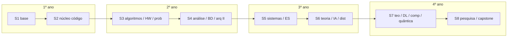

# Graduação em Ciência da Computação — equivalência **4 anos** (8 semestres)

Este documento **organiza o currículo deste repositório** como um **bacharelado típico de 4 anos** (duas disciplinas por semestre em média **não** — aqui a carga é **densa**; ajuste ao seu ritmo). A **fonte canónica de pré-requisitos** continua a ser o grafo em [`data/curriculum.json`](../data/curriculum.json) e o script `python3 tools/curriculum_progress.py` (bloqueios reais).

**Objetivo:** do **básico ao perfil de especialista**, com **provas de nível**, **projetos** e **teoria útil** — alinhado ao [README principal](../README.md), ao [checklist](../checklist.md), ao [banco de exercícios](exercicios-por-disciplina.md) e às [especializações](../specializations/).

---

## Princípios (robustez)

| Princípio | O que significa |
|-----------|-----------------|
| **Grafo primeiro** | Se uma linha desta tabela conflitar com o JSON, **prevalece o JSON**. |
| **Paralelismo** | Disciplinas no **mesmo semestre** podem ser estudadas em paralelo **só se** todos os pré-requisitos diretos já estiverem concluídos no teu `progress.json`. |
| **Engenharia transversal** | Git, testes, CI e segurança mental não são “matérias à parte”: são **obrigação contínua** (ver coluna *Engenharia* no [README](../README.md)). |
| **Especialização** | A partir do **3.º ano**, escolha **uma ou mais** trilhas em [`specializations/`](../specializations/) e um **capstone** por trilha ([rubrica](rubrica-capstone.md)). |

---

## Carga e ritmo (referência)

- **Estimativa grosseira:** ~**3 000–4 000 h** de estudo profundo no total (ordem de grandeza de um bacharelado presencial com disciplinas bem cumpridas — **autodidata exige disciplina**).
- **Semana tipo** durante os semestres “cheios”: ver diagrama em [`assets/ciclo-semana-estudo.svg`](../assets/ciclo-semana-estudo.svg).
- **Pré-voo (semanas 1–4):** ver secção *Pré-voo obrigatório* no [README principal](../README.md) antes de contar como “semestre 1” formal.

---

## Mapa por ano e semestre

Os **IDs** entre `…` são os de `curriculum.json` (úteis para `progress.json` e relatórios).

### 1.º ano — Fundamentos lógicos, máquina e primeiro código forte

| Semestre | Foco | Disciplinas (IDs) | Notas |
|----------|------|-------------------|-------|
| **S1** | Base matemática, bits, primeiras linguagens | `discreta`, `circuitos`, `ling_prog`, `prog1`, `geo` | Carga alta: são **cinco** núcleos em paralelo; é propositado. |
| **S2** | Cálculo e linear entram; ED e OO consolidam código | `calc1`, `alg_lin1`, `ed`, `prog2`, `oo` | `calc1`/`alg_lin1` exigem `geo`; `ed` exige `discreta`+`prog1`; `prog2` exige `prog1`+`ling_prog`. |

**Engenharia até aqui:** repositório Git com README honesto, `.editorconfig`, convenção de commits; início de **TDD** e **CI** (mínimo) antes de fechar o 1.º ano.

---

### 2.º ano — Algoritmos, arquitetura, probabilidade e persistência

| Semestre | Foco | Disciplinas (IDs) | Notas |
|----------|------|-------------------|-------|
| **S3** | Grafos, hardware I, prob., cálculo avançado, funcional | `grafos`, `arq1`, `prob_est`, `calc2`, `funcional`, `met_num`, `teo_grafos` | Carga **muito alta** (7 itens): pode mover `teo_grafos` ou `met_num` para o início do S4 mantendo o grafo. `teo_grafos` só exige `discreta`. `met_num` exige `prog1`+`calc1`. |
| **S4** | Análise, numérico aplicado, BD, arquitetura II, lógica, Cálculo III | `analise_alg`, `bd`, `arq2`, `prog_logica`, `calc3` | `analise_alg` precisa `grafos`; `arq2` precisa `prog2`+`arq1`; `calc3` precisa `calc2`; `prog_logica` precisa `discreta`; `bd` precisa `prog1`. |

**Engenharia até aqui:** **migrations** versionadas, **ADR** curto em decisão de dados; leitura **OWASP** em paralelo (ver etapa 5 do README).

---

### 3.º ano — Sistemas, engenharia de software, IA base e distribuídos

| Semestre | Foco | Disciplinas (IDs) | Notas |
|----------|------|-------------------|-------|
| **S5** | Redes, ES, SO, otimização, gráfica | `redes`, `eng_sw`, `so`, `prog_mat`, `comp_grafica` | `so` precisa `arq2`; `prog_mat` precisa `alg_lin1`; `comp_grafica` precisa `geo`. |
| **S6** | Autômatos, IA, distribuídos (+ reforço em teoria de grafos se ainda não fechou) | `automatos`, `ia`, `dist` e, se faltar, `teo_grafos` | `ia` precisa `ed`+`prob_est`; `dist` precisa `redes`; `automatos` precisa `discreta`. Se `teo_grafos` já foi em S3, use o tempo para **módulos elevados** ou projetos. |

**Módulos elevados** ([`extras/modulos-elevados.md`](../extras/modulos-elevados.md)) em paralelo: **concorrência**, **segurança aplicada**, **observabilidade** — tratados como **primeira classe**, não opcionais para perfil sênior.

---

### 4.º ano — Teoria avançada, ML profundo, compiladores, pesquisa e **especialista**

| Semestre | Foco | Disciplinas (IDs) | Notas |
|----------|------|-------------------|-------|
| **S7** | Limite da computação, DL, compiladores, quântica (opcional forte) | `teo_comp`, `dl`, `compiladores`, `quantica` | `teo_comp` precisa `automatos`; `dl` precisa `ia`; `compiladores` precisa `ed`+`teo_grafos`; `quantica` precisa `calc3`+`arq2`. |
| **S8** | Metodologia científica, **TCC/capstone**, trilha(s) de especialização | `met_pesquisa` + **capstone** + [`specializations/`](../specializations/) | `met_pesquisa` precisa `eng_sw`. Reserve **um semestre inteiro** para projeto capstone com [rubrica](rubrica-capstone.md) e portfólio público. |

**Perfil “especialista”** ao final do 4.º ano: domínio sólido do núcleo + **pelo menos uma** trilha profunda (dados, web, DevOps, segurança, gráfica, embarcados, teoria formal) com **artefatos verificáveis** (repos, benchmarks, posts técnicos).

---

## Uma página: onde está cada ID no tempo sugerido

| ID | Ano.sem sugerido |
|----|------------------|
| discreta, circuitos, ling_prog, prog1, geo | 1.1 |
| calc1, alg_lin1, ed, prog2, oo | 1.2 |
| grafos, arq1, prob_est, calc2, funcional, met_num, teo_grafos* | 2.1 |
| analise_alg, bd, arq2, prog_logica, calc3 | 2.2 |
| redes, eng_sw, so, prog_mat, comp_grafica | 3.1 |
| automatos, ia, dist, (teo_grafos se não feito antes) | 3.2 |
| teo_comp, dl, compiladores, quantica | 4.1 |
| met_pesquisa + capstone + especialização | 4.2 |

\*`teo_grafos` pode antecipar-se ao 2.1 se quiser desbloquear mentalmente `compiladores` mais cedo.

---

## Diagrama Mermaid (visão temporal — **não** substitui o grafo de pré-requisitos)

---

## Ferramentas para não “quebrar” o plano

1. `bash tools/verify_repo.sh` — schemas + DAG + Mermaid + alinhamento `exercicios-por-disciplina.md` ↔ semestres S1–S8 + testes.  
2. `python3 tools/curriculum_progress.py` — o que está **bloqueado** e **pronto** com base em `data/progress.json`.  
3. [docs/curriculum-progresso.md](curriculum-progresso.md) — como interpretar o relatório.

---

## Leitura obrigatória depois desta página

- [README principal](../README.md) — **provas de nível** por disciplina.  
- [docs/exercicios-por-disciplina.md](exercicios-por-disciplina.md) — exercícios por etapa, **semestre sugerido** por disciplina e **Etapa 8** (capstone + trilhas em `specializations/`).  
- [extras/modulos-elevados.md](../extras/modulos-elevados.md) — o que separa “formado por vídeo” de **engenheiro**.  
- [specializations/](../specializations/) — trilhas de **especialista**.

---

*Última revisão: alinhado ao `curriculum.json` versão 2 e à estrutura de etapas do README. Ajuste semestral se o teu contexto (trabalho, família) exigir — o grafo de pré-requisitos é a restrição dura; o calendário é orientação.*
